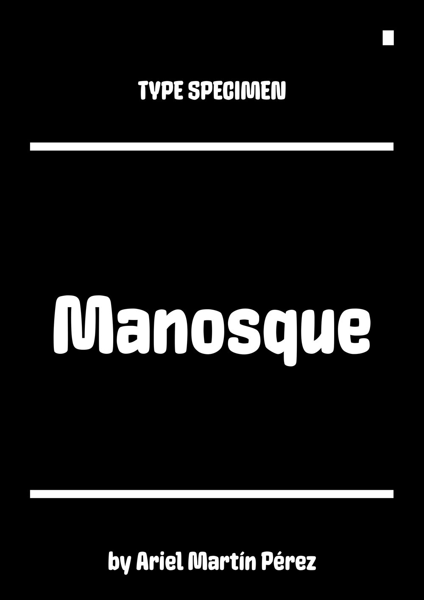
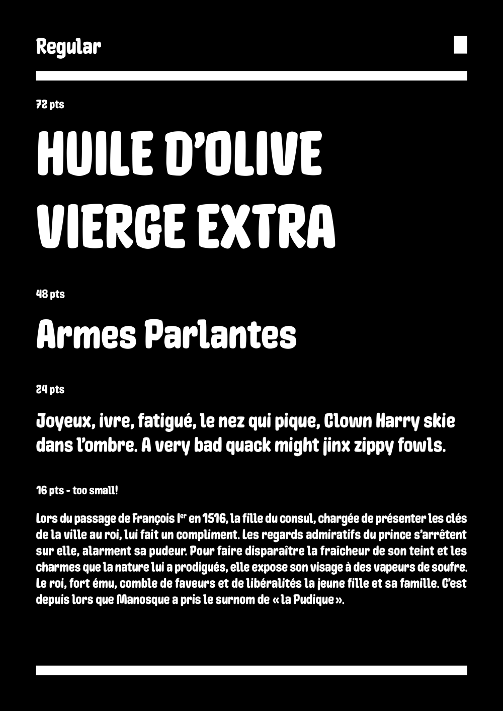
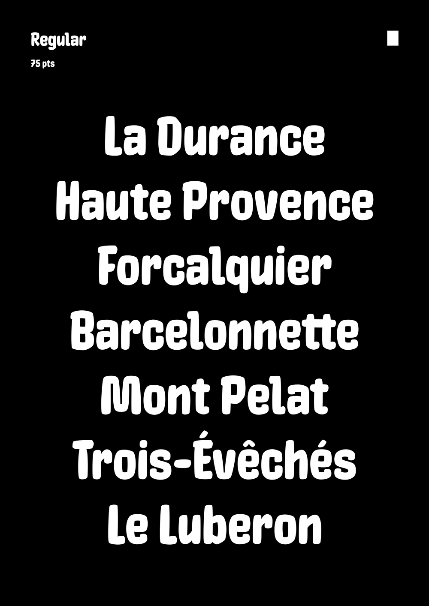

# Manosque

<strong>[EN]</strong>

Manosque is a typeface inspired by a lettering piece found in the train station of Manosque (a city in the south of France). It’s also based on other letterforms used in public signs and transportation during the late 19th century and the early 20th century in France. 

During the process of studying those designs, I found that drawing them with a flat brush was a good way to harmonise the shapes coming from its different sources, so that’s how Manosque in its present form was born.

Manosque provides language support for all Latin-based European languages.

Manosque has been created by Ariel Martín Pérez (https://tainome.com/ - contact@tainome.com) and released under the SIL Open Font Licence 1.1 in 2020. Manosque is distributed by the Tunera Type Foundry (www.tunera.xyz).

To know how to use this typeface, please read the FAQ (http://www.tunera.xyz/faq/) 

<strong>[FR]</strong>

Manosque est un caractère typographique inspiré par un lettrage trouvé dans la gare de Manosque (une ville du sud de la France). Il est également basé sur d'autres formes de lettres qui étaient utilisées pour la signalétique et pour les transports publics à la fin du XIXe siècle et au début du XXe siècle en France.

Au cours de l'étude de ces formes, j'ai trouvé que les dessiner avec un pinceau plat était un bon moyen d'harmoniser leur aspect malgré leurs différentes sources, et c'est ainsi qu'est né Manosque dans sa forme actuelle.

Manosque fournit du support linguistique pour toutes les langues européennes basées sur le latin.

Manosque a été créé par Ariel Martín Pérez (https://tainome.com/ - contact@arielgraphisme.com) et publié sous la licence SIL Open Font License 1.1 en 2020. Manosque est distribué par Tunera Type Foundry (www.tunera.xyz).

Pour savoir comment utiliser cette fonte, veuillez lire la FAQ (http://www.tunera.xyz/faq-2/)

<strong>[ES]</strong>

Manosque es un tipo de letra inspirado en un letrero encontrado en la estación de tren de Manosque (una ciudad en el sur de Francia). También está basado en otras formas de letras utilizadas en señales públicas y de transporte a finales del siglo XIX y a principios del siglo XX en Francia.

Durante el proceso de estudio de esos diseños, descubrí que reproducirlos con un pincel plano era una buena manera de armonizar sus formas, que provienen de fuentes diversas, y así nació Manosque en su forma actual.

Manosque ofrece soporte lingüístico para todos los idiomas europeos basados en el alfabeto latino.

Manosque ha sido creado por Ariel Martín Pérez (https://tainome.com/ - contact@arielgraphisme.com) y publicado bajo la licencia SIL Open Font License 1.1 en 2020. Manosque es distribuido por Tunera Type Foundry (www.tunera.xyz).

Para saber cómo usar este tipo de letra, lea las preguntas frecuentes (http://www.tunera.xyz/preguntas-frecuentes/)

## Specimen

## License

Manosque is licensed under the SIL Open Font License, Version 1.1.
This license is copied below, and is also available with a FAQ at
http://scripts.sil.org/OFL

## Repository Layout

This font repository follows the Unified Font Repository v2.0,
a standard way to organize font project source files. Learn more at
https://github.com/unified-font-repository/Unified-Font-Repository
